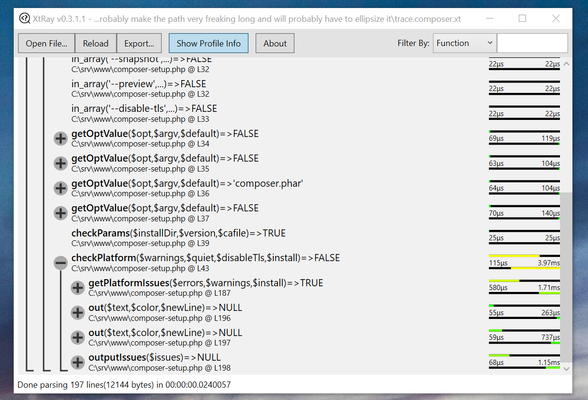

# Xt-Ray    
> The Xdebug call trace toolkit

<!--  -->
This project aims to create cross-platform tools for parsing, viewing and analyzing Xdebug call trace files(.xt).

## Getting started

Download the latest release binaries from [the github releases page](https://github.com/gasparportik/xt-ray/releases) 

**or** download the source and build, if there is no binary for your platform.

### Windows

Both the CLI tool and the GUI application are built for .NET Framework 4.5, which is installed by default if you have Windows10, otherwise it can be downloaded from [this official Microsoft page](https://www.microsoft.com/en-us/download/details.aspx?id=30653).

In most cases you simply need to unzip the release package to a folder and run xtray-win.exe. Alternatively you can find a trace file(one with a .xt extension), choose `Open with` from the context menu and select `Choose another app` from the submenu, then you have to select xtray-win.exe; this will associate the file type to it.

### MacOS

The Gtk# version of the application could potentially work on macOS, but I don't have a mac to test that. 
Any help building/bringing this app to macos is greatly appreciated.

### Linux

The Gtk# version of the application was designed to work on Linux, however currently the feature gap between the WPF and the Gtk# version is quite large, so no binary builds are distributed right now.

### Setting up Xdebug correctly

See [the related article](./content/xdebug-setup.md)

## Features

This monorepo hosts projects for three purposes:
* a .NET standard library, exposing an API for parsing Xdebug trace files
* a CLI application, for viewing and manipulating Xdebug trace files on the command line
* a couple of GUI applications, for inspecting the trace files interactively

### The Library(XtRay.ParserLib)
The sole purpose of this library is to take a trace file and parse it(using various methods) to either a trace list or a trace tree.

Once the clutter has been removed and tests have been added, the plan is to publish the library to the NuGet repo.

### Command Line Interface app(XtRay.Console)
 - ✅ parse a trace file given as argument
 - ✅ dump a parsed trace in various styles
 - 🚧 parse file from standard input
 - 🚧 apply filters to call tree
 - 🚧 output back to standard xdebug trace format
 - 🚧 keyboard interactive navigation through the trace

### Windows WPF GUI app(XtRay.Windows)
 - ✅ open a trace file and display it as expandable call tree with profile information
 - ✅ inspect various properties of trace calls(like parameters, return value, performance stats)
 - ✅ filter displayed call tree nodes by specific criteria
 - ✅ export the parsed trace to a more easily processable json format
 - 🚧 more filters(call time, memory usage, is user-defined, etc.)
 - 🚧 save filtered call tree to standard xdebug trace format
 - 🚧 map trace file locations to local paths
 - 🚧 show php code for selected call by loading local files
 - 🚧 analyse call parameter usage and compare to local file function signature
 - 🚧 a more polished user interface

#### Feature icon meanings
🔨 - work in progress

🚧 - planned

✅ - finished

### Cross Platform GTK# app(XtRay.GtkSharp)
Implements a more limited set of functionality, than the WPF version, however the end goal is to achieve feature-parity.

## Contributing
🦗 Feel free to submit ideas and bugs to the [issues](https://github.com/gasparportik/xt-ray) of this repository. 🦗

💡 Any code improvements and feature implementations are welcome, so please do fork and submit pull requests. 💡 

## Licensing

> The code in this project is licensed under the Mozilla Public License 2.
